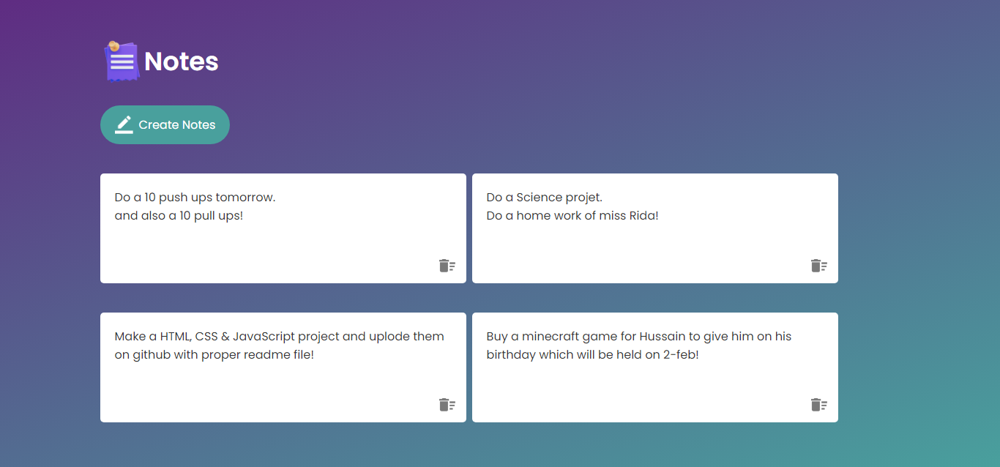

# Notes Web App

## Overview

The Notes Web App is a simple yet powerful application that allows users to create, edit, and delete notes. The application is designed to store notes locally on the user's browser using the local storage mechanism. This ensures that users can access their notes even after closing and reopening the application.

## Features

### 1. Note Creation and Editing

Users can create new notes by clicking on the "New Note" button. Each note can be edited in a user-friendly interface. The app provides a clean and distraction-free environment for note-taking.

### 2. Local Storage

All notes are automatically saved to the browser's local storage in real-time. This means that users don't have to worry about losing their notes, even if they close the browser or navigate away from the app.

### 3. Note Deletion

Users can delete unwanted notes with a simple click, providing a straightforward way to manage their notes.

### 4. Responsive Design

The application is designed to work seamlessly across various devices and screen sizes, ensuring a consistent and user-friendly experience for all users.

## Usage

To use the Notes Web App, follow these steps:

1. Visit the [web app URL].
2. Click on the "New Note" button to create a new note.
3. Start typing your note in the provided text area.
4. Your notes are automatically saved to the local storage.
5. To delete a note, click on the delete icon next to the note.